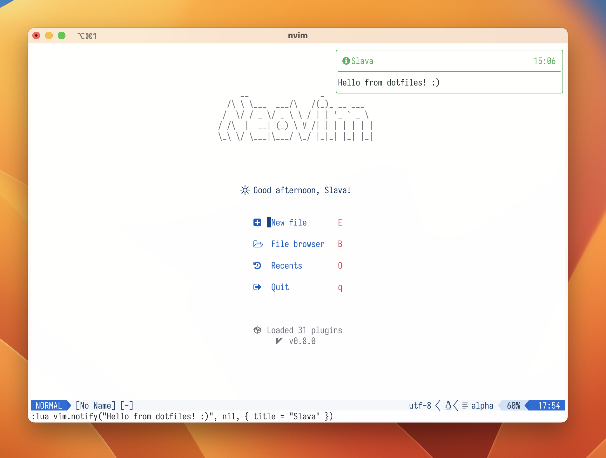
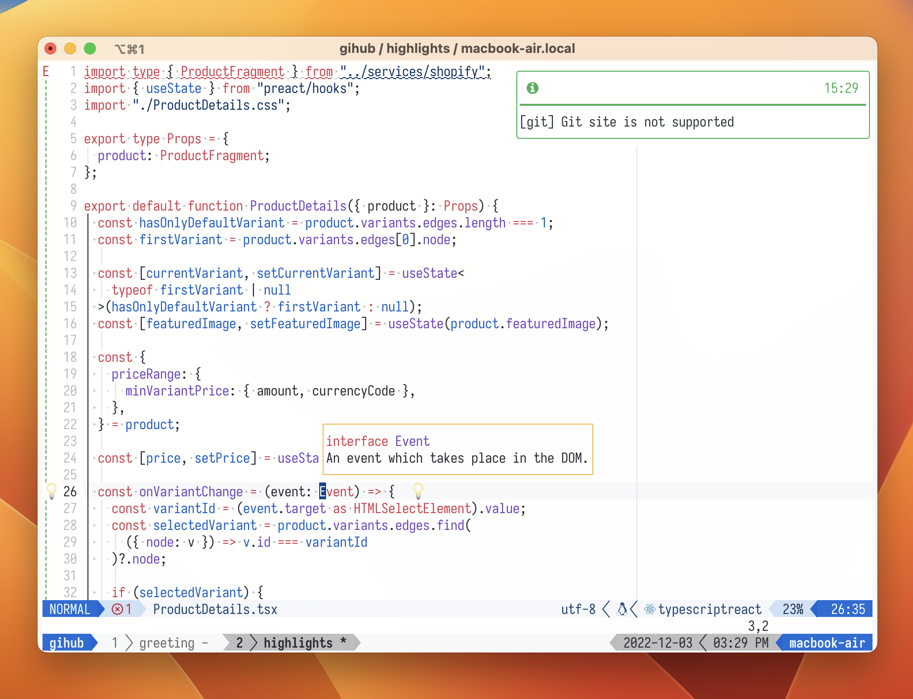

# Configurations for MacOS/Ubuntu

## Requirements

Make sure to these package is installed to your system:

- `git`
- `make`
- `neovim`

## Contents

Includes configurations for:

- [iTerm](https://iterm2.com/)
- [Neovim](https://neovim.io/)
- [Tmux](https://github.com/tmux/tmux)
- [zsh](https://www.zsh.org/)
- [oh-my-zsh](https://github.com/ohmyzsh/ohmyzsh)

## How to use

Run these commands in your terminal:

```sh
git clone git@github.com:slavamak/dotfiles.git
cd dotfiles

# preparations and install core packages
# this will install iterm, neovim, tmux, zsh, oh-my-zsh and more
make

# install asdf runtime version manager
make asdf

# reload shell with new configuration
source ~/.zshrc

# install nodejs and ruby with asdf
make asdf-plugins

# optional
make node-packages
```

## Neovim

Requires Neovim version >= 0.8.0

> 1. Before launch Neovim, make sure that [tree-sitter](https://github.com/tree-sitter/tree-sitter/) is installed globally
> 2. After that update the parsers with command `:TSUpdate`

### Plugins

**WIP** - I think a few plugins are not perfectly configured, I'll fix that later (or not)

- [wbthomason/packer.nvim](https://github.com/wbthomason/packer.nvim) - Plugin manager
- [nvim-lua/plenary.nvim](https://github.com/nvim-lua/plenary.nvim) - Lua functions for Neovim
- [kyazdani42/nvim-web-devicons](https://github.com/kyazdani42/nvim-web-devicons) - Adds file type icons
- [norcalli/nvim-colorizer.lua](https://github.com/norcalli/nvim-colorizer.lua) - A high-performance color highlighter
- [projekt0n/github-nvim-theme](https://github.com/projekt0n/github-nvim-theme) - Github color themes
- [nvim-lualine/lualine.nvim](https://github.com/nvim-lualine/lualine.nvim) - Statusline
- [onsails/lspkind-nvim](https://github.com/onsails/lspkind-nvim) - Adds vscode-like pictograms
- [L3MON4D3/LuaSnip](https://github.com/L3MON4D3/LuaSnip) - A snippet engine
- [hrsh7th/nvim-cmp](https://github.com/hrsh7th/nvim-cmp) - A completion engine
- [hrsh7th/cmp-nvim-lsp](https://github.com/hrsh7th/cmp-nvim-lsp) - More types of completion candidates for LSP
- [hrsh7th/cmp-buffer](https://github.com/hrsh7th/cmp-buffer) - Source for buffer words
- [folke/lsp-colors.nvim](https://github.com/folke/lsp-colors.nvim) - Creates missing LSP diagnostics highlight groups
- [neovim/nvim-lspconfig](https://github.com/neovim/nvim-lspconfig) - Configurations for LSP
- [jose-elias-alvarez/null-ls.nvim](https://github.com/jose-elias-alvarez/null-ls.nvim) - LSP diagnostics, code actions, formating
- [williamboman/mason.nvim](https://github.com/williamboman/mason.nvim) - Easily install and manage LSP
- [williamboman/mason-lspconfig.nvim](https://github.com/williamboman/mason-lspconfig.nvim) - Extension that makes it easier to use lspconfig
- [jayp0521/mason-null-ls.nvim](https://github.com/jayp0521/mason-null-ls.nvim) - Extension that makes it easier to use null-ls
- [glepnir/lspsaga.nvim](https://github.com/glepnir/lspsaga.nvim) - A light-weight UI plugin for LSP
- [nvim-treesitter/nvim-treesitter](https://github.com/nvim-treesitter/nvim-treesitter) - Syntax highlighting
- [nvim-treesitter/playground](https://github.com/nvim-treesitter/playground) - Show treesitter and syntax highlight groups
- [nvim-telescope/telescope.nvim](https://github.com/nvim-telescope/telescope.nvim) - Highly extendable fuzzy finder
- [nvim-telescope/telescope-file-browser.nvim](https://github.com/nvim-telescope/telescope-file-browser.nvim) - File Browser extension
- [windwp/nvim-autopairs](https://github.com/windwp/nvim-autopairs) - Auto close brackets
- [windwp/nvim-ts-autotag](https://github.com/windwp/nvim-ts-autotag) - Auto close and auto rename html tags
- [lewis6991/gitsigns.nvim](https://github.com/lewis6991/gitsigns.nvim) - Git decorations for buffers
- [dinhhuy258/git.nvim](https://github.com/dinhhuy258/git.nvim) - Git wrapper
- [gpanders/editorconfig.nvim](https://github.com/gpanders/editorconfig.nvim) - Support for EditorConfig
- [rcarriga/nvim-notify](https://github.com/rcarriga/nvim-notify) - Notification manager
- [lukas-reineke/indent-blankline.nvim](https://github.com/lukas-reineke/indent-blankline.nvim) - Indentation guides to all lines
- [goolord/alpha-nvim](https://github.com/goolord/alpha-nvim) - A beautiful greeting
- [xiyaowong/virtcolumn.nvim](https://github.com/xiyaowong/virtcolumn.nvim) - Display a line as the colorcolumn

## iTerm

Settings and colors theme

## Tmux

Base configuration, key bindings and colors theme

## zsh

With zsh also installs **oh-my-zsh** - framework for managing configuration. This framework includes few plugins:

- asdf
- gh
- git
- macos/ubuntu *(uncomment the appropriate one in the file [.zshrc](https://github.com/slavamak/dotfiles/blob/main/.config/zsh/.zshrc))*
- tmux
- z

Read the documentation on these and other plugins [here](https://github.com/ohmyzsh/ohmyzsh/tree/master/plugins)

## Thanks

Thanks a lot for the inspiration [craftzdog](https://github.com/craftzdog), [mokevnin](https://github.com/mokevnin) and the other cool folks at github :)
